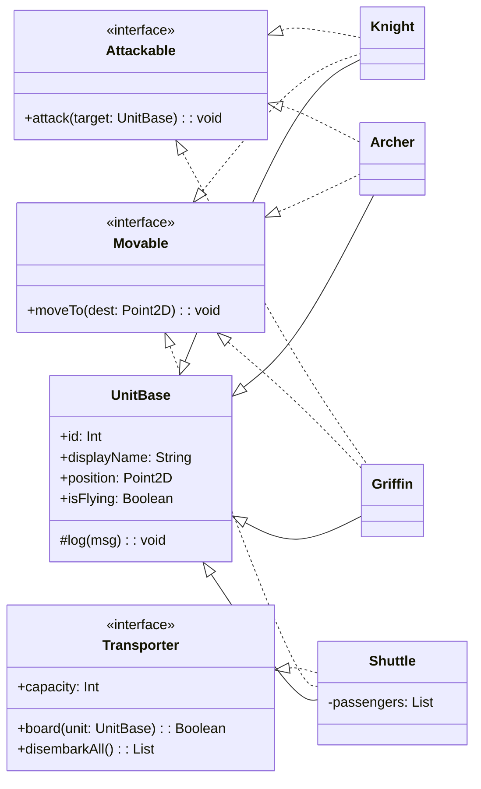

# game-character (Kotlin · Gradle)

중세 RTS를 배경으로 **Knight / Archer / Shuttle / Griffin** 캐릭터의 이동·공격·수송 규칙을 구현한 콘솔 프로그램입니다.  
과제 PDF의 모든 요구사항(생성 → 탑승 → 이동 → 하차 → 타입별 공격 시연)을 **한글 로그**로 재현합니다.

---

## 1) 실행 · 테스트

```bash
# 빌드 & 실행
./gradlew run

# 빌드
./gradlew build

# 단위 테스트
./gradlew test
```

권장 환경: JDK 17, Gradle 8.9+

---

## 2) 프롬프트 활용방법 (Prompt Playbook)

프로젝트 진행 중 ChatGPT(또는 LLM)에게 던질 핵심 프롬프트 유형과 의도입니다.

### A. 요구사항 해석·검증
**프롬프트**
> “과제 PDF에서 *반드시 지켜야 할 규칙*만 bullet로 추려줘. ‘누가/언제/무엇을/제한’ 형태로 말해. 반례도 같이.”

**이유**  
자연어 요구를 **검증 가능한 규칙**으로 변환 → 테스트 포인트 명확화, 구현 누락 방지.

### B. 설계 대안 비교
**프롬프트**
> “이동/공격/수송을 인터페이스로 분리한 설계 vs. 상속만 사용하는 설계를  
> 중복·확장성·테스트 용이성 기준으로 비교하고, 과제 범위에 적합안을 추천해.”

**이유**  
**행위 인터페이스 분리** 채택의 근거 확보 → OOP 의사결정 기록(발표/리뷰 설득력↑).

### C. 코드 리뷰(규칙 위반 감시)
**프롬프트**
> “아래 코드에서 과제 규칙 위반 가능성(예: 비행 대상 공격 차단 누락)과  
> 메시지 한글화 누락을 찾아 수정 diff를 제안해.”

**이유**  
룰 체킹을 자동화해서 **휴먼 에러** 최소화(감점 리스크 제거).

### D. 리팩토링/확장 가이드
**프롬프트**
> “신규 비행 유닛 ‘Dragon(광역 화염, 비행만 공격 가능)’을  
> 최소 수정으로 추가하는 절차를 커밋 단위로 나눠줘.”

**이유**  
변경 영향도 최소화 → **안전한 확장** 유도.

---

## 3) 왜 그 프롬프트를 썼는가 (Rationale)

- **규칙의 기계화**: “Knight는 비행 공격 불가” 같은 문장을 **불리언 플래그(`isFlying`) + 분기**로 맵핑.  
  프롬프트 A로 규칙을 명시화하면, 코드/테스트가 *검증 가능한 단위*로 정리됩니다.
- **행위 분리(인터페이스)**: 이동/공격/수송을 `Movable/Attackable/Transporter`로 분리 →  
  신규 유닛의 **조합 다양성**(예: 이동만 되는 NPC, 공격만 하는 타워) 보장.
- **리뷰·리팩토링 자동화**: 프롬프트 C로 규칙 위반·국문 로그 누락 목록화 → **감점 리스크** 제거.
- **커밋 단위 설계**: 프롬프트 D로 **작은 단계** 강제 → 빌드/실행 안정성 유지.

---

## 4) 코드 구조와 설계 의도

### 4.1 디렉터리
```
src/main/kotlin/com/example/game/
├─ Main.kt                       # 시나리오 실행(생성→탑승→이동→하차→공격 시연)
├─ core/
│  ├─ Point2D.kt                 # 2D 좌표
│  └─ UnitBase.kt                # 모든 유닛의 공통 속성/로그
├─ traits/
│  ├─ Movable.kt                 # 이동 행위
│  ├─ Attackable.kt              # 공격 행위
│  └─ Transporter.kt             # 수송 행위(정원/탑승/하차)
└─ units/
   ├─ Knight.kt                  # 지상, 창 / 비행 대상 공격 불가
   ├─ Archer.kt                  # 지상, 화살 / 지상·공중 모두 공격 가능
   ├─ Griffin.kt                 # 비행, 번개 / 비행 대상 공격 불가(지상만)
   └─ Shuttle.kt                 # 비행 수송, Knight/Archer만 탑승, 정원 8
```

### 4.2 설계 원칙
- **SRP(단일 책임)**: 공통 속성은 `UnitBase`, 행위는 인터페이스로 분리.
- **OCP(개방·폐쇄)**: 새 유닛 추가 시 기존 클래스 수정 최소화(규칙은 각 유닛 내부에 캡슐화).
- **LSP(리스코프 치환)**: 상위 타입(`UnitBase`)으로 안전하게 다룰 수 있게 구현.
- **가독성/채점 친화**: 모든 동작을 **한글 로그**로 일관 출력(과제 조건 직접 반영).

---

## 5) 클래스 간 관계(다이어그램)




---

## 6) 규칙 구현 체크리스트(과제 요구사항 매핑)

- [x] 캐릭터 4종(Knight/Archer/Shuttle/Griffin)
- [x] 이동: 좌표(Point2D)로 이동, 캐릭터별 안내 로그(말/도보/비행)
- [x] 공격:
  - Knight: **비행 대상 공격 불가**, 창
  - Archer: **지상/공중 모두 가능**, 화살
  - Griffin: **비행 대상 공격 불가**, 지상만 번개
- [x] 수송: Shuttle **정원 8**, **Knight/Archer만 탑승**
- [x] 시나리오: Knight 16 + Archer 16 → Shuttle 4대 탑승 → Griffin 5와 이동 → **전원 하차** → 타입별 공격 시연
- [x] 모든 행동 **한글 출력 (`println`)**
- [x] Gradle build/run 가능, README 실행 명령 기재

---

## 7) 핵심 코드 스니펫 (규칙 포인트)

```kotlin
// Knight: 비행 대상 공격 불가
override fun attack(target: UnitBase) {
    if (target.isFlying) {
        log("공격 불가: 날아다니는 대상(${target.displayName}#${target.id})은 창으로 공격할 수 없습니다.")
        return
    }
    log("창으로 ${target.displayName}#${target.id} 를 찌릅니다!")
}
```

```kotlin
// Griffin: 비행 대상 공격 불가(지상만 타격)
override fun attack(target: UnitBase) {
    if (target.isFlying) {
        log("공격 불가: 날아다니는 대상(${target.displayName}#${target.id})에게는 번개를 내릴 수 없습니다.")
        return
    }
    log("하늘에서 번개를 내려 ${target.displayName}#${target.id} 를 공격합니다!")
}
```

```kotlin
// Shuttle: Knight/Archer만 탑승, 정원 8
override fun board(unit: UnitBase): Boolean {
    val allowed = unit is Knight || unit is Archer
    if (!allowed) {
        log("탑승 실패: ${unit.displayName}#${unit.id} 은(는) 탑승할 수 없습니다.")
        return false
    }
    if (passengers.size >= capacity) {
        log("탑승 실패: 정원 초과(${capacity}).")
        return false
    }
    passengers += unit
    log("${unit.displayName}#${unit.id} 탑승 완료. (현재 ${passengers.size}/${capacity})")
    return true
}
```

---

## 8) 샘플 실행 로그(일부)

```
=== 셔틀 탑승: Knight 16, Archer 16 → Shuttle 4대(정원 8×4=32) ===
[셔틀#1] 기사#1 탑승 완료. (현재 1/8)
...
=== Griffin 5기 + Shuttle 4대가 함께 이동 ===
[셔틀#1] 하늘을 날아 (0, 0) → (100, 50) 로 이동합니다. (탑승자 8명 동반)
...
=== 도착지에서 셔틀 전원 하차 ===
[셔틀#1] 승객 8명 전원 하차.
...
- Griffin의 공격 시연(타입별 1기):
[그리핀#1] 공격 불가: 날아다니는 대상(셔틀#1)에게는 번개를 내릴 수 없습니다.
```

---

## 9) 테스트(요점)

- 룰 기반 플래그(`isFlying`)와 타입 조합을 통해 **규칙 위반을 예방**.
- `./gradlew test` 로 기본 속성/관계 체크(확장 시 케이스 추가 권장).

---

## 10) 확장 아이디어

- **새 유닛 추가**: Dragon(비행만 공격 가능), Tower(공격만, 이동 불가)
- **전투 판정 강화**: 체력/사거리/쿨다운/피해량/우선순위
- **로그 포맷터**: 시간/좌표/행동코드로 표준화 → 파일 로깅

---

